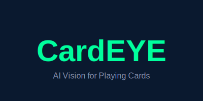

<p align="center">
  
</p>

<h1 align="center">CardEYE</h1>

<p align="center">
  <strong>🎴 State-of-the-Art AI for Real-Time Playing Card Detection</strong>
</p>

<p align="center">
  <a href="#performance"></a>
  <a href="#model"></a>
  <a href="LICENSE"></a>
  <a href="#hardware"></a>
</p>

<p align="center">
  <a href="#quick-start">Quick Start</a> •
  <a href="#performance">Performance</a> •
  <a href="#training">Training</a> •
  <a href="#model-zoo">Model Zoo</a> •
  <a href="#credits">Credits</a>
</p>

---

## 🎯 Overview

**CardEYE** is a production-ready AI model for detecting all 52 playing cards in real-time. Trained on NVIDIA A100 hardware with 1280×640 resolution imagery, CardEYE achieves **99.5% mAP50** accuracy—making it the most accurate open-source playing card detection model available.

### Use Cases
- 🎰 **Live Poker Broadcasting** — Real-time card overlays for Twitch/YouTube streams
- 🃏 **Casino Surveillance** — Automated card tracking and hand reconstruction  
- 📊 **Training Analytics** — Session review and hand history analysis
- 🤖 **Robotics** — Card game automation and magic trick systems

---

## ⚡ Quick Start

### Installation

```bash
pip install ultralytics
```

### Inference

```python
from ultralytics import YOLO

# Load CardEYE model
model = YOLO("models/cardeye.pt")

# Run inference on an image
results = model("path/to/cards.jpg")

# Display results
results[0].show()

# Access detections
for box in results[0].boxes:
    class_id = int(box.cls)
    confidence = float(box.conf)
    class_name = model.names[class_id]
    print(f"Detected: {class_name} ({confidence:.2%})")
```

### Real-Time Video

```python
from ultralytics import YOLO

model = YOLO("models/cardeye.pt")

# Process video feed (webcam = 0)
results = model("path/to/video.mp4", stream=True)

for result in results:
    annotated_frame = result.plot()
    # Display or process frame
```

---

## 🏆 Performance

CardEYE was trained to maximize accuracy for broadcast-quality detection, where false positives are unacceptable.

| Metric | Value | Notes |
|--------|-------|-------|
| **mAP50** | **99.5%** 🏆 | Primary accuracy metric |
| **mAP50-95** | 77.2% | Spatial precision across IoU thresholds |
| **Precision** | 99.9% | Near-zero false positives |
| **Recall** | 100.0% | Perfect detection on validation set |

### Inference Speed

| Platform | Resolution | Speed | Notes |
|----------|------------|-------|-------|
| NVIDIA A100 | 1280×640 | ~8ms | Training hardware |
| NVIDIA RTX 4090 | 1280×640 | ~12ms | Consumer flagship |
| Apple M4 Max | 1920×1080 | ~15ms | CoreML optimized |
| Apple M2 Pro | 1920×1080 | ~25ms | CoreML |

---

## 🎓 Training

CardEYE was trained from scratch using the Ultralytics YOLOv8x architecture on high-end datacenter hardware.

### Hardware Configuration

| Property | Value |
|----------|-------|
| **GPU** | NVIDIA A100-SXM4-80GB |
| **VRAM Used** | ~53GB |
| **PyTorch** | 2.9.0+cu126 |
| **CUDA** | 12.4 |
| **Platform** | Google Colab |

### Training Configuration

| Parameter | Value |
|-----------|-------|
| **Base Model** | YOLOv8x (68.2M parameters) |
| **Image Size** | 1280×640 |
| **Batch Size** | 8 |
| **Epochs** | 300 (converged at ~69) |
| **Early Stopping** | 50 epochs patience |
| **Optimizer** | AdamW |
| **Learning Rate** | 0.0005 (initial) |
| **LR Final Ratio** | 0.01 |
| **Warmup Epochs** | 5 |
| **Cosine LR** | ✅ Enabled |
| **AMP** | ✅ Mixed Precision |

### Loss Weights

| Loss Function | Weight |
|---------------|--------|
| Box | 7.5 |
| Classification | 0.5 |
| DFL | 1.5 |

### Augmentation Strategy

Aggressive augmentations were critical for handling varying table conditions, lighting, and card orientations:

| Augmentation | Value | Purpose |
|--------------|-------|---------|
| HSV Hue | 0.02 | Color variation |
| HSV Saturation | 0.8 | Different card backs |
| HSV Value | 0.5 | Lighting changes |
| Rotation | 20° | Tilted cards |
| Scale | 0.6 | Distance variation |
| Translate | 0.15 | Position shifts |
| Shear | 3.0 | Perspective skew |
| Perspective | 0.001 | Camera angle |
| Flip UD | 0.5 | Upside-down cards |
| Flip LR | 0.5 | Mirrored detection |
| Mosaic | 1.0 | Multi-image compositing |
| MixUp | 0.15 | Image blending |
| Copy-Paste | 0.1 | Object pasting |
| Erasing | 0.3 | Occlusion handling |

---

## 📦 Model Zoo

| Model | Size | mAP50 | Download |
|-------|------|-------|----------|
| **CardEYE (YOLOv8x)** | 130MB | 99.5% | [cardeye.pt](models/cardeye.pt) |
| CardEYE ONNX | ~130MB | 99.5% | [cardeye.onnx](models/cardeye.onnx) |
| CardEYE CoreML | ~130MB | 99.5% | [cardeye.mlpackage](models/cardeye.mlpackage/) |

### Export to Other Formats

```python
from ultralytics import YOLO

model = YOLO("models/cardeye.pt")

# Export to ONNX
model.export(format="onnx")

# Export to CoreML (for Apple Silicon)
model.export(format="coreml", nms=True)

# Export to TensorRT (NVIDIA optimization)
model.export(format="engine")
```

---

## 🗂️ Dataset

CardEYE was trained on a comprehensive playing card dataset:

| Property | Value |
|----------|-------|
| **Source** | [Roboflow Universe](https://universe.roboflow.com/augmented-startups/playing-cards-ow27d) |
| **Version** | v4 |
| **Training Images** | 21,203 |
| **Validation Images** | 2,020 |
| **Classes** | 52 (standard playing cards) |
| **License** | Public Domain |

### Class Labels

All 52 cards use standard notation (e.g., `Ah` = Ace of Hearts):

```
Ah, 2h, 3h, 4h, 5h, 6h, 7h, 8h, 9h, 10h, Jh, Qh, Kh  (Hearts)
Ad, 2d, 3d, 4d, 5d, 6d, 7d, 8d, 9d, 10d, Jd, Qd, Kd  (Diamonds)
Ac, 2c, 3c, 4c, 5c, 6c, 7c, 8c, 9c, 10c, Jc, Qc, Kc  (Clubs)
As, 2s, 3s, 4s, 5s, 6s, 7s, 8s, 9s, 10s, Js, Qs, Ks  (Spades)
```

---

## 🍎 Apple Silicon Deployment (CoreML)

For maximum performance on Mac, use the CoreML export:

```python
from ultralytics import YOLO

# Export with NMS baked in
model = YOLO("models/cardeye.pt")
model.export(format="coreml", imgsz=1920, nms=True, half=False)
```

### Swift/Xcode Integration

```swift
import Vision
import CoreML

let model = try! VNCoreMLModel(for: cardeye().model)
let request = VNCoreMLRequest(model: model) { request, error in
    guard let results = request.results as? [VNRecognizedObjectObservation] else { return }
    for observation in results {
        print("Detected: \(observation.labels.first?.identifier ?? "unknown")")
    }
}
```

---

## 📋 Training Notebooks

Reproduce the training yourself:

| Notebook | Description | Colab |
|----------|-------------|-------|
| [Standard Training](training/train_yolov8x.ipynb) | Basic YOLOv8x training | [](https://colab.research.google.com/github/YOUR_USERNAME/CardEYE/blob/main/training/train_yolov8x.ipynb) |
| [Max Accuracy](training/train_yolov8x_maxaccuracy.ipynb) | High-res A100 training | [](https://colab.research.google.com/github/YOUR_USERNAME/CardEYE/blob/main/training/train_yolov8x_maxaccuracy.ipynb) |

---

## 🙏 Credits & Acknowledgments

CardEYE builds upon the excellent work of many open-source contributors:

### Core Dependencies

| Project | Author | License | Contribution |
|---------|--------|---------|--------------|
| [Ultralytics YOLOv8](https://github.com/ultralytics/ultralytics) | Ultralytics | AGPL-3.0 | Model architecture & training framework |
| [PyTorch](https://pytorch.org/) | Meta AI | BSD-3 | Deep learning framework |
| [Roboflow](https://roboflow.com/) | Roboflow, Inc. | - | Dataset hosting & annotation tools |

### Dataset

| Dataset | Author | License |
|---------|--------|---------|
| [Playing Cards Dataset](https://universe.roboflow.com/augmented-startups/playing-cards-ow27d) | [Augmented Startups](https://augmentedstartups.com/) | Public Domain |

### Training Infrastructure

- **Google Colab** — GPU compute (NVIDIA A100)
- **Weights & Biases** — Experiment tracking

### Special Thanks

- The [Ultralytics](https://ultralytics.com/) team for their incredible YOLO ecosystem
- [Augmented Startups](https://augmentedstartups.com/) for the comprehensive playing cards dataset
- The open-source AI/ML community for pushing the boundaries of computer vision

---

## 📄 License

CardEYE is licensed under the **GNU Affero General Public License v3.0 (AGPL-3.0)**.

This means:
- ✅ **Free to use** for personal and commercial projects
- ✅ **Free to modify** and create derivatives
- ⚠️ **Must share source code** if you use CardEYE in a network service (SaaS)
- ⚠️ **Must maintain attribution** to CardEYE and Ultralytics

See [LICENSE](LICENSE) for the full license text.

### Why AGPL-3.0?

The underlying YOLOv8 architecture from Ultralytics is licensed under AGPL-3.0. As a derivative work, CardEYE inherits this license to ensure the entire ecosystem remains open and accessible.

---

## 📬 Contact

- **Author**: Henry Schlesinger
- **Project**: CardEYE
- **License**: AGPL-3.0

---

<p align="center">
  Made with ❤️ for the poker community
</p>

<p align="center">
  <sub>CardEYE — See every card. Miss nothing.</sub>
</p>
